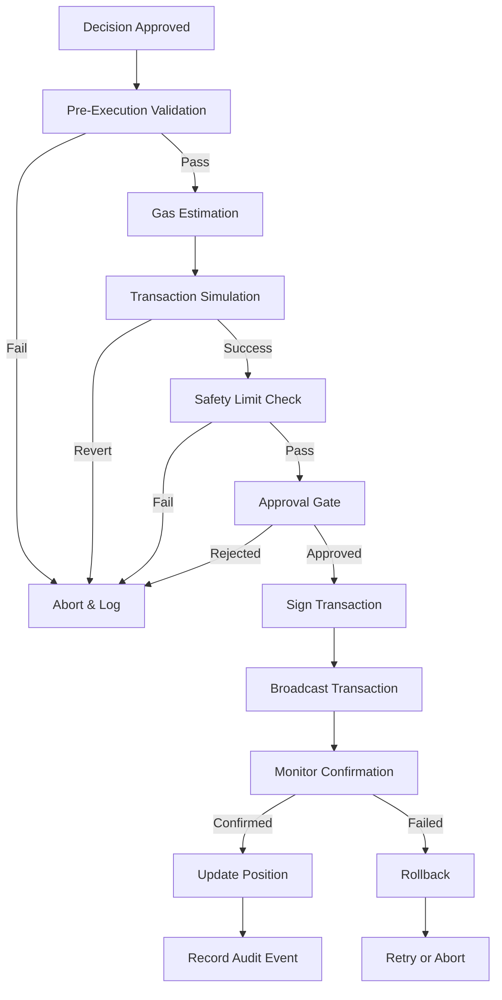

# Phase 3: Live Execution Implementation

## Overview

Phase 3 focuses on implementing live transaction execution capabilities for the Ratio LP automation system. This phase transitions from dry-run simulation to production-ready transaction execution with comprehensive safety mechanisms.

## Status: **PLANNING** 🔵

## Objectives

1. **Gas Estimation Engine**: Implement accurate gas estimation and optimization
## Status: **IN PROGRESS** 🚧3. **Staged Live Validation**: Multi-stage validation before execution
4. **Rollback Logic**: Transaction rollback and error recovery
5. **Position Execution**: Uniswap v3 position management via smart contracts

---

## Components

### 1. Gas Estimation Engine

**Location**: `packages/execution-engine/src/gas/`

#### Features
- Real-time gas price fetching (EIP-1559 support)
- Historical gas analysis for optimization
- Dynamic gas limit calculation
- Priority fee recommendations
- Gas cost estimation per operation type

#### Implementation Tasks

- [ ] Create `GasEstimator` service
  - `estimateGasPrice()`: Fetch current base fee + priority fee
  - `estimateGasLimit()`: Calculate gas limit for transaction type
  - `optimizeGasCost()`: Find optimal timing for execution
  - `validateGasBudget()`: Ensure execution within budget

- [ ] Integrate gas oracles
  - Blocknative Gas API
  - Etherscan Gas Tracker
  - Fallback to RPC `eth_gasPrice`

- [ ] Gas monitoring & alerts
  - Track gas spending per position
  - Alert when gas exceeds threshold
  - Log all gas estimations and actual costs

#### Configuration

```typescript
interface GasConfig {
  maxGasPrice: bigint;          // Maximum acceptable gas price (gwei)
  maxPriorityFee: bigint;       // Maximum priority fee (gwei)
  gasLimitBuffer: number;       // Buffer percentage (e.g., 1.2 = 20%)
  estimationTimeout: number;    // Timeout for gas estimation (ms)
  retryAttempts: number;        // Retry count for failed estimations
}
```

---

### 2. Hot Wallet Operations

**Location**: `packages/execution-engine/src/wallet/`

#### Security Requirements

- **Never commit private keys** to repository
- **Environment-only secrets**: Load from `process.env` at runtime
- **Encrypted storage**: Use KMS or encrypted environment variables
- **Limited permissions**: Hot wallet should have minimal ETH balance
- **Multi-sig fallback**: For high-value operations

#### Implementation Tasks

- [ ] Create `WalletManager` service
  - `loadWallet()`: Load wallet from encrypted env
  - `signTransaction()`: Sign prepared transactions
  - `sendTransaction()`: Broadcast signed transactions
  - `checkBalance()`: Monitor ETH and token balances

- [ ] Wallet safety checks
  - Verify wallet address matches expected
  - Check sufficient balance before execution
  - Validate nonce management
  - Implement nonce queue for sequential txs

- [ ] Audit logging
  - Log all wallet operations
  - Record transaction hashes
  - Track wallet balance changes
  - Immutable audit trail in database

#### Configuration

```typescript
interface WalletConfig {
  privateKeyEnv: string;        // Env variable name for private key
  minEthBalance: bigint;        // Minimum ETH required (wei)
  maxDailyGasSpend: bigint;     // Maximum daily gas spend (wei)
  nonceStrategy: 'sequential' | 'parallel';
  requiresApproval: boolean;    // Require manual approval flag
}
```

---

### 3. Staged Live Validation

**Location**: `packages/execution-engine/src/validation/`

#### Validation Stages

**Stage 1: Pre-Execution Checks**
- [ ] Verify execution mode is `live`
- [ ] Confirm policy approval exists
- [ ] Validate wallet balance sufficient
- [ ] Check gas price within acceptable range
- [ ] Verify pool state hasn't changed

**Stage 2: Transaction Simulation**
- [ ] Simulate transaction via RPC `eth_call`
- [ ] Verify expected outcome (slippage, amounts)
- [ ] Check for revert conditions
- [ ] Validate post-execution state

**Stage 3: Safety Limits**
- [ ] Position size within capital limits
- [ ] Daily transaction count under threshold
- [ ] Gas spending within budget
- [ ] No blacklisted tokens or pools

**Stage 4: Final Approval Gate**
- [ ] Two-step confirmation for high-value txs
- [ ] Telegram approval required above threshold
- [ ] Time-delayed execution for large positions

#### Implementation Tasks

- [ ] Create `ValidationPipeline` service
  - `validatePreExecution()`: Run all pre-checks
  - `simulateTransaction()`: Test via eth_call
  - `validateSafetyLimits()`: Check all limits
  - `requireApproval()`: Trigger approval workflow

- [ ] Error handling
  - Graceful failure for validation errors
  - Detailed error logging
  - Rollback to dry-run on critical failure

---

### 4. Rollback Logic

**Location**: `packages/execution-engine/src/rollback/`

#### Rollback Scenarios

- **Transaction Failure**: Reverted on-chain
- **Unexpected Slippage**: Execution outside tolerance
- **Pool State Change**: Pool data stale during execution
- **Gas Price Spike**: Gas cost exceeds budget
- **Balance Insufficient**: Not enough ETH or tokens

#### Implementation Tasks

- [ ] Create `RollbackManager` service
  - `detectFailure()`: Monitor tx status
  - `rollbackPosition()`: Close failed positions
  - `refundGas()`: Track gas refunds
  - `notifyFailure()`: Alert ops-bot

- [ ] State recovery
  - Mark position as `failed`
  - Update decision status to `rolled_back`
  - Log rollback reason in audit trail
  - Notify Telegram with failure details

- [ ] Retry logic
  - Exponential backoff for retryable errors
  - Maximum retry attempts (default: 3)
  - Different strategies per error type

#### Configuration

```typescript
interface RollbackConfig {
  maxRetryAttempts: number;     // Max retries per tx
  retryBackoffMs: number;       // Base backoff time (ms)
  autoRollbackEnabled: boolean; // Auto-rollback on failure
  alertThreshold: number;       // Alert after N failures
}
```

---

### 5. Position Execution

**Location**: `packages/execution-engine/src/position/`

#### Uniswap v3 Operations

**Open Position**
- [ ] Approve tokens to NonfungiblePositionManager
- [ ] Call `mint()` with position parameters
- [ ] Store NFT token ID in database
- [ ] Record position details

**Close Position**
- [ ] Call `decreaseLiquidity()` to remove liquidity
- [ ] Call `collect()` to collect fees and tokens
- [ ] Call `burn()` to burn NFT
- [ ] Update position status to `closed`

**Rebalance Position**
- [ ] Close existing position
- [ ] Calculate new tick range
- [ ] Open new position with adjusted parameters
- [ ] Record rebalance event

#### Implementation Tasks

- [ ] Create `PositionExecutor` service
  - `openPosition()`: Mint new Uniswap v3 position
  - `closePosition()`: Remove liquidity and burn NFT
  - `rebalancePosition()`: Close and reopen with new range
  - `collectFees()`: Collect accumulated fees

- [ ] Contract interaction
  - Use ethers.js or viem for contract calls
  - Handle transaction signing
  - Monitor transaction confirmation
  - Parse event logs for NFT ID

- [ ] Slippage protection
  - Calculate `amount0Min` and `amount1Min`
  - Use deadline parameter (e.g., 15 minutes)
  - Verify output amounts match expectations

#### Configuration

```typescript
interface PositionConfig {
  slippageTolerance: number;    // Slippage tolerance (0.01 = 1%)
  deadlineMinutes: number;      // Transaction deadline
  confirmationsRequired: number; // Block confirmations
  maxPositionSize: bigint;      // Max position size (USD)
}
```

---

## Execution Flow



---

## Safety Mechanisms

### Capital Limits
- **Per-position cap**: Maximum USD value per position
- **Daily volume limit**: Maximum total daily execution volume
- **Pool concentration**: Maximum % of pool TVL per position

### Execution Throttling
- **Rate limiting**: Max transactions per hour
- **Cooldown period**: Minimum time between rebalances
- **Batch execution**: Group multiple operations

### Monitoring & Alerts
- **Real-time monitoring**: Track all live executions
- **Telegram alerts**: Notify on execution, failure, rollback
- **Dashboard metrics**: Gas spent, success rate, P&L
- **Anomaly detection**: Alert on unusual patterns

---

## Testing Strategy

### Unit Tests
- [ ] Gas estimator logic
- [ ] Wallet manager operations
- [ ] Validation pipeline stages
- [ ] Rollback manager recovery
- [ ] Position executor calculations

### Integration Tests
- [ ] Full execution flow (testnet)
- [ ] Rollback scenarios
- [ ] Approval workflow
- [ ] Multi-position management

### Staging Environment
- [ ] Deploy to Sepolia testnet
- [ ] Use testnet ETH and tokens
- [ ] Simulate real-world conditions
- [ ] Load testing with multiple positions

---

## Environment Variables

```bash
# Execution Mode
EXECUTION_MODE=live                # "dry_run" or "live"

# Wallet Configuration
WALLET_PRIVATE_KEY=0x...           # Hot wallet private key (NEVER COMMIT)
MIN_ETH_BALANCE=0.1                # Minimum ETH required

# Gas Configuration
MAX_GAS_PRICE=50                   # Maximum gas price (gwei)
MAX_PRIORITY_FEE=2                 # Maximum priority fee (gwei)

# Safety Limits
MAX_POSITION_SIZE_USD=10000        # Maximum position size
MAX_DAILY_GAS_SPEND=0.05           # Maximum daily gas (ETH)
DAILY_TX_LIMIT=50                  # Maximum daily transactions

# Approval Configuration
APPROVAL_THRESHOLD_USD=5000        # Require approval above this value
APPROVAL_TIMEOUT_SECONDS=3600      # Approval timeout (1 hour)

# Contract Addresses (Mainnet)
UNISWAP_V3_NFT_MANAGER=0xC36442b4a4522E871399CD717aBDD847Ab11FE88
UNISWAP_V3_FACTORY=0x1F98431c8aD98523631AE4a59f267346ea31F984
```

---

## Milestones

### Milestone 1: Gas & Wallet (Week 1-2) ✅ COMPLETE- [x] Design gas estimation service ✅
- [ ] Implement `GasEstimator` ✅
- [ ] Implement `WalletManager` ✅
- [ ] Unit tests for gas & wallet ✅
- [ ] Integration with execution engine ✅

### Milestone 2: Validation & Safety (Week 3-4) 🚧 IN PROGRESS- [ ] Implement `ValidationPipeline` 🚧
- [ ] Build safety limit checks
- [ ] Create approval workflow
- [ ] Transaction simulation testing
- [ ] Testnet deployment

### Milestone 3: Execution & Rollback (Week 5-6) 🚧 IN PROGRESS- [ ] Implement `PositionExecutor` 🚧
- [ ] Build `RollbackManager` 🚧
- [ ] Contract integration (Uniswap v3)
- [ ] End-to-end testing on testnet
- [ ] Staging environment validation

### Milestone 4: Production Readiness (Week 7-8)
- [ ] Security audit (smart contract interactions)
- [ ] Load testing and stress testing
- [ ] Monitoring and alerting setup
- [ ] Documentation and runbooks
- [ ] Gradual rollout with limited capital

---

## Risks & Mitigation

| Risk | Impact | Likelihood | Mitigation |
|------|--------|------------|------------|
| Private key exposure | Critical | Low | Environment-only secrets, KMS encryption |
| Gas price spike | High | Medium | Max gas price limits, gas monitoring |
| Transaction revert | Medium | Medium | Simulation before execution, rollback logic |
| Insufficient balance | Medium | Low | Balance monitoring, alerts |
| Slippage exceeded | Medium | Medium | Slippage tolerance, deadline parameter |
| Contract bug | Critical | Low | Audited contracts, staging environment testing |
| Network congestion | Medium | High | Gas price adjustment, retry logic |

---

## Success Criteria

- ✅ **Zero unauthorized transactions**: All executions require approval
- ✅ **Gas efficiency**: Average gas cost < 0.01 ETH per operation
- ✅ **High success rate**: > 95% transaction success rate
- ✅ **Fast execution**: Average confirmation time < 5 minutes
- ✅ **Comprehensive logging**: 100% audit trail coverage
- ✅ **Secure operations**: No private key leaks, proper encryption

---

## Next Phase: Phase 4 (LLM Lab)

After Phase 3 completion:
- Narrative engine for qualitative analysis
- Strategy lab for LLM-driven experimentation
- Constrained proposals with risk vetoes
- Candidate promotion workflow

---

## References

- [Uniswap v3 SDK](https://docs.uniswap.org/sdk/v3/overview)
- [Uniswap v3 Periphery Contracts](https://github.com/Uniswap/v3-periphery)
- [EIP-1559 Gas Estimation](https://eips.ethereum.org/EIPS/eip-1559)
- [ethers.js Documentation](https://docs.ethers.org/v6/)
- [Blocknative Gas API](https://www.blocknative.com/gas-estimator)

---

**Document Version**: 1.0  
**Last Updated**: 2026-05-26  
**Status**: Planning Phase  
**Owner**: Ratio Development Team
